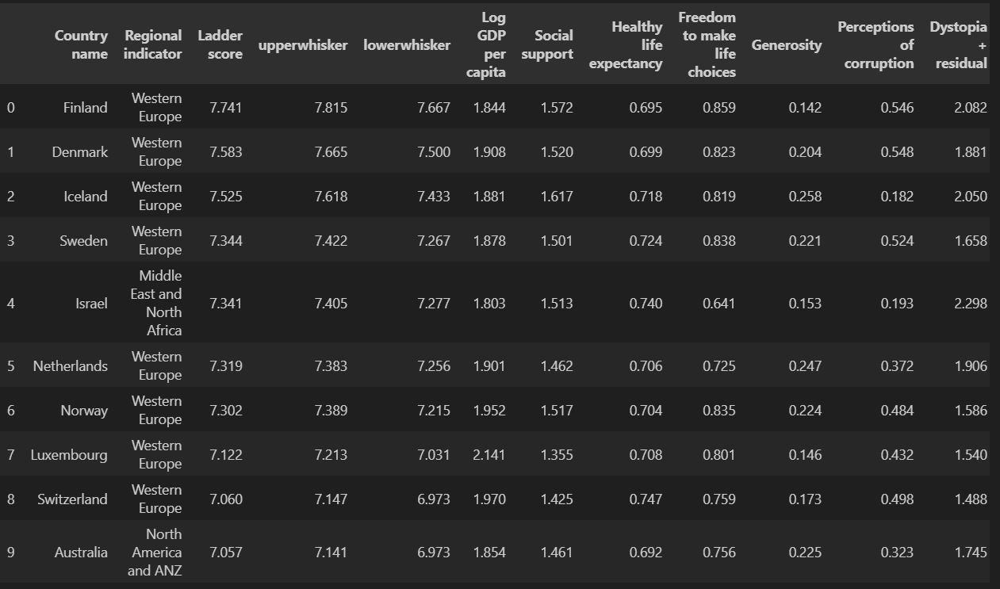
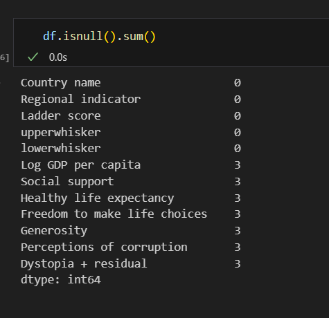
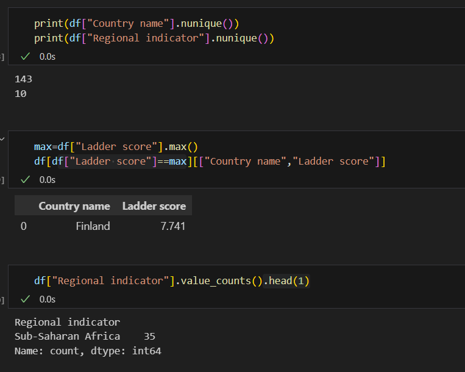
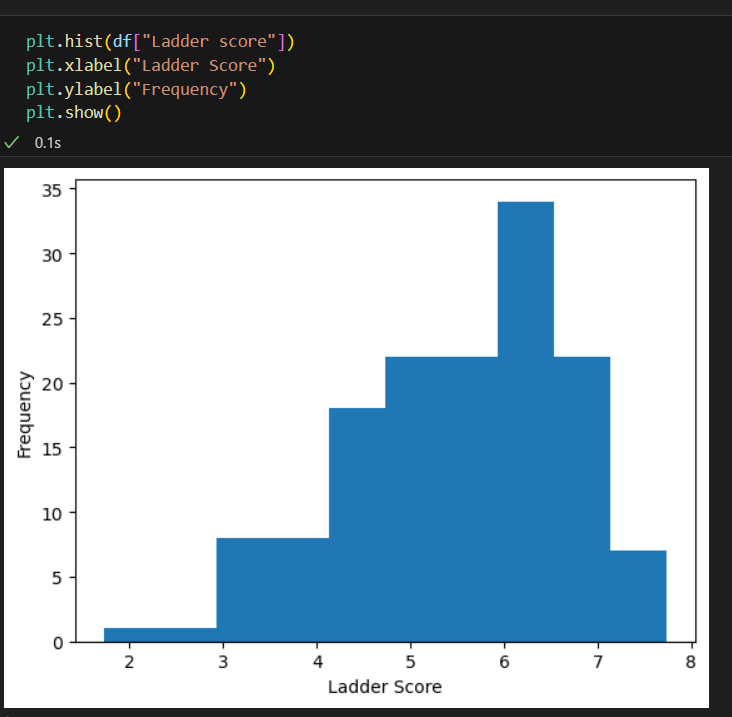
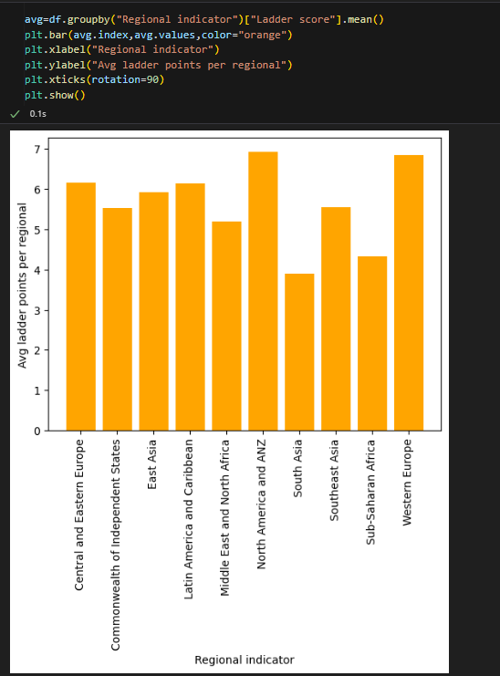
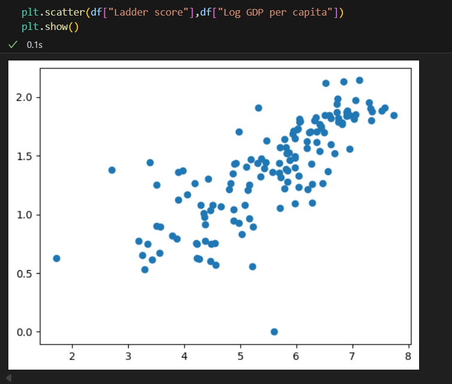
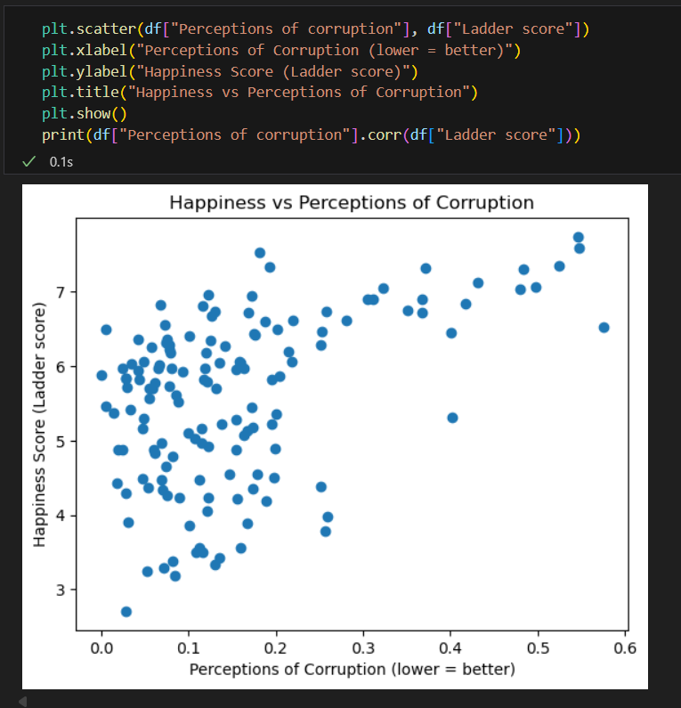

Detailed Project Workflow & Output Explanations

1. Data Loading and Inspection

Task:

1.Load the World Happiness Report 2024 dataset (World-happiness-report-2024.csv) into a Pandas DataFrame.
2.Inspect the first few rows, columns, and datatypes.

Output:

1.Displays a table with columns such as:
2.Country name
3.Regional indicator
4.Ladder score (happiness score)
5.Log GDP per capita
6.Social support
7.Healthy life expectancy
8.Freedom to make life choices
9.Generosity
10.Perceptions of corruption

Confirms data is loaded correctly and all relevant fields are present.

Interpretation:

The dataset covers countries’ happiness scores along with various socio-economic factors. Ladder score is the primary ranking metric.

2. Data Cleaning & Preparation

Task:

1.Check for missing values and handle them if necessary.
2.Ensure numeric fields are properly typed.
3.Remove any duplicate rows.

Output:

1.A summary showing the number of null values per column (often zero for this dataset).
2.A cleaned dataset ready for analysis.

Interpretation:

Clean data ensures that later statistical analyses and visualizations are accurate.

3. Descriptive Statistics

Task:

1.Compute summary statistics (mean, median, min, max) for all numerical columns.

Output:

1.A table summarizing central tendencies and ranges for each metric.

Example: Ladder score might range from ~2.4 (least happy) to ~7.7 (most happy).

Interpretation:
Gives a quick idea of overall well-being distribution and extremes.

4. Distribution of Happiness Scores

Task:

1.Plot a histogram of Ladder score.

Output: 

A histogram showing how happiness scores are distributed across all countries.

Interpretation:

Peaks show common score ranges.

If skewed toward higher scores, most countries report high happiness; if skewed low, opposite is true.

5. Top 10 Happiest Countries

Task:

2.Sort data by Ladder score and plot the top 10.

Output: 

A horizontal bar chart showing the happiest countries (e.g., Finland, Denmark, Iceland at the top).

Interpretation:

Western Europe dominates top rankings.

Helps identify regions with consistently high well-being.

6. GDP vs Happiness Scatter Plot

Task:

1.Scatter plot Log GDP per capita vs Ladder score.

Output: 

Scatter points with trend line.

Interpretation:

Wealthier countries tend to be happier, but after a certain point, the increase slows.

7. Corruption vs Happiness

Task:

Scatter plot Perceptions of corruption vs Ladder score.

Output: 

Countries with lower corruption perception scores are generally happier.

Conclusion

The 2024 World Happiness Report shows that happiness depends on both economic and social factors.
Strong GDP, social support, and life expectancy correlate with higher happiness.
High corruption perception is linked to lower well-being.
True happiness thrives in healthy, free, and supportive societies.